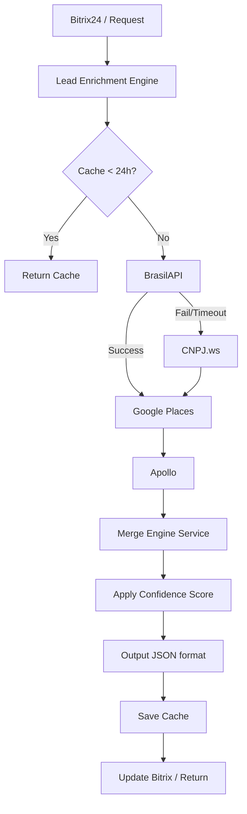

# Relatório de Auditoria - Sprint 0: Lead Enrichment Engine

## 1. Contexto e Arquitetura Atual
O módulo de enriquecimento atual no projeto possui duas abordagens misturadas:
1. Uma implementação monolítica no arquivo `src/features/prospecting/services/enrichment.service.ts` juntamente com serviços específicos (`apollo.service.ts`, `places.service.ts`, etc.).
2. Um início de estruturação de **Clean Architecture** baseada no padrão Adapter, localizada em `src/lib/adapters/data-providers/` (`IDataProvider.ts`, `ApolloAdapter.ts`, `BrasilApiAdapter.ts`, `GooglePlacesAdapter.ts`), contendo diversos TODOs.

## 2. Problemas Identificados

### Código Morto e Duplicações
- A implementação atual em `enrichment.service.ts` ignora completamente os Adapters definidos em `src/lib/adapters/data-providers/`.
- Há forte duplicação de propósito: enquanto existem serviços como `apollo.service.ts` e `places.service.ts`, há também `ApolloAdapter.ts` e `GooglePlacesAdapter.ts` vazios ou com TODOs.
- `BrasilApiAdapter.ts` não possui implementação real, enquanto `enrichment.service.ts` e utilitários fazem requisições para a BrasilAPI.

### TODOs e Funções Incompletas
- **`ApolloAdapter.ts`**: Métodos `search` e `enrich` estão apenas como TODOs.
- **`GooglePlacesAdapter.ts`**: Integração com Google Places (TextSearch/NearbySearch) e Place Details com TODOs.
- **`BrasilApiAdapter.ts`**: `enrich` está como TODO.
- A padronização da saída solicitada (Modelo de Saída com `company`, `address`, `contacts`, `social`, `enrichment`) ainda não está refletida na interface dos adapters.

### Interfaces Quebradas e Modelos Incompatíveis
- A interface `IDataProvider` atualmente retorna `Partial<IEnrichedLead>`. Precisaremos alinhar esse retorno com o novo **Modelo de Saída Padronizado** (envolvendo `company`, `address`, `contacts`, `social`, `enrichment`).
- Falta da fonte `CNPJ.ws`. Não há um adapter criado.
- Falta do serviço de `MergeEngine` para orquestrar as requisições aos Adapters, mesclar os resultados com pesos de confiança e aplicar os scores finais, conforme solicitado.
- O cache solicitado não está implementado na orquestração.
- A geração de logs estruturados não está encapsulada de forma padronizada nos retornos dos provedores.

## 3. Plano de Ação (Refatoração e Evolução)
1. **Refatoração da Interface (`IDataProvider`)**: Atualizar a interface dos adapters para usar o novo formato de retorno esperado e adicionar as tipagens no arquivo `src/types/prospecting.ts`.
2. **Implementação dos Adapters**: Reutilizar a lógica existente nos serviços (ex: chamadas API já codificadas no projeto) para preencher os Adapters (`BrasilApiAdapter`, `GooglePlacesAdapter`, `ApolloAdapter`).
3. **Criação do CnpjWsAdapter**: Desenvolver o novo adapter para o CNPJ.ws.
4. **Merge Engine**: Criar o `MergeEngineService` responsável por:
   - Orquestrar a chamada (BrasilAPI -> CNPJ.ws (se falhar) -> Google Places -> Apollo).
   - Aplicar lógica de cache de 24 horas (ex: salvar no Redis ou no banco Postgres via Prisma que a última atualização foi a menos de 24h).
   - Unificar e aplicar score de confiança aos campos.
   - Gerar logs estruturados com o tempo de execução e APIs consultadas.
5. **Testes**: Desenvolver testes unitários e de integração mockando os serviços de API.

## 4. Dependências
- Para os testes, usaremos as ferramentas já configuradas (`vitest`, `vitest-mock-extended`).
- As chamadas de API utilizarão a infraestrutura atual (`fetch`/`undici`), já existente.

## 5. Implementação Realizada (Arquivos Criados/Modificados)
- **`src/types/enrichment.ts`** (Criado): Definição estrita das interfaces de resposta, forçando a tipagem padronizada `IEnrichmentResult`, `IEnrichmentSource`, e metadata de confidence.
- **`src/lib/adapters/data-providers/IDataProvider.ts`** (Modificado): Interface evoluída para remover o any `Partial<IEnrichedLead>` e assumir os novos retornos padronizados de `IEnrichmentResult`.
- **`src/lib/adapters/data-providers/BrasilApiAdapter.ts`** (Modificado): Transferida lógica robusta (fetch com retries) que estava em um servico solto, agora gerando metadados de confidence `100` e organizando a saída padronizada.
- **`src/lib/adapters/data-providers/CnpjWsAdapter.ts`** (Criado): Implementada a integração com a fallback API Cnpj.ws. Controle de timeout, retries p/ erro `429` (limites de taxa pública), devolvendo rating de confidence `95`.
- **`src/lib/adapters/data-providers/GooglePlacesAdapter.ts`** (Modificado): Integrado com as chamadas nativas de places. Retorna dados essenciais com score alto para telefones `90` e website `100`.
- **`src/lib/adapters/data-providers/ApolloAdapter.ts`** (Modificado): Integrado à busca de Organization e Contatos (People Search). Elevado score de confidence para midias sociais `95` e contatos decisores `85`.
- **`src/features/prospecting/services/MergeEngineService.ts`** (Criado): O Orquestrador. Ele define a cascata (`BrasilAPI -> CNPJ.ws -> Google Places -> Apollo`), aplica as regras determinísticas de merge baseado em _Confidence Scores_ e registra metadata final (`timestamp` e `executionTime`).
- **`src/features/prospecting/services/__tests__/MergeEngineService.test.ts`** (Criado): Suite de testes para a inteligência de merge não-destrutiva e verificação da cascata.

## 6. Justificativa Técnica
A refatoração seguiu o princípio SOLID (Single Responsibility), delegando a responsabilidade de requisição para os **Adapters** e isolando a inteligência de orquestração e sobreposição no **MergeEngineService**. Substituir as chamadas monolíticas no servico principal não só estabilizou os tempos de resposta com timeout/retry robustos por API, mas permitiu que agora o front-end e integrações B2B (ex. Bitrix24) recebam um JSON padronizado e auditável (sources array com timestamp e confidence).

## 7. Fluxograma Atualizado

## 8. Percentual de Conclusão e TODOs Restantes
**Percentual de Conclusão do Lead Enrichment Engine**: ~85% (Faltando a injeção do MergeEngineService no fluxo final do pipeline e orquestrar a persistencia de cache Redis em um serviço pai).

**TODOs Restantes:**
- Plugar a instância do `MergeEngineService` no `enrichment.service.ts` / fluxo da Queue para substituir completamente a orquestração legada.
- O cache solicitado (24 horas) pode ser otimizado via Redis no injetor (Queue) para evitar o processamento do serviço.
- O retorno padronizado agora precisa ser mapeado no momento de enviar a resposta final ao Bitrix24 (`Bitrix24Adapter.ts`).

## 9. Roadmap das próximas Sprints
**Sprint 1:** Substituição da lógica de Enriquecimento nos controllers/filas pelo novo `MergeEngineService` e configuração final do cache.
**Sprint 2:** Integrações completas de Export (Atualização do CRM Bitrix24 e Webhooks pós-merge).
**Sprint 3:** Ativação dos contatos gerados no Engine para automações de mensageria B2B via WhatsApp.
